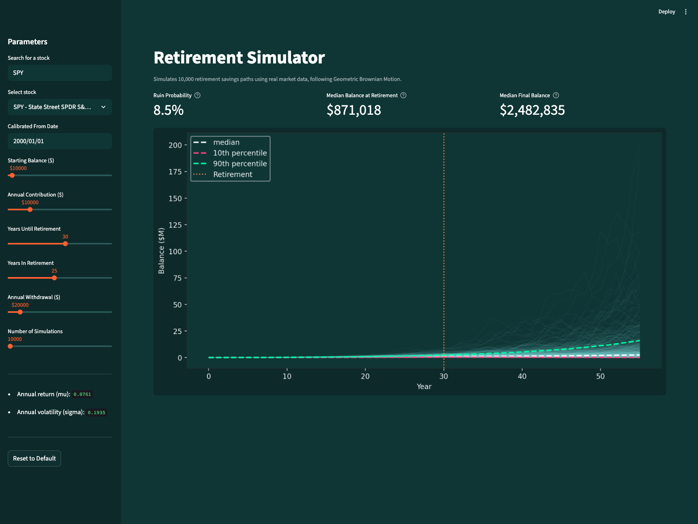
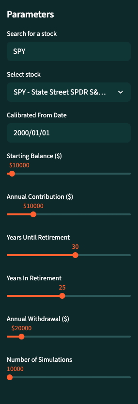

# Geometric Brownian Motion Retirement Simulator

An interactive retirement risk simulator built with Python and Streamlit. Pulls real historical market data from Yahoo Finance, calibrates return assumptions from a user-selected stock and date range, and runs a configurable number of simulated retirement savings paths using Geometric Brownian Motion (GBM).



## What it does

Given a set of personal financial inputs, the simulator models thousands of possible futures for a retirement savings portfolio. The key outputted metrics are:

- **Ruin Probability** — the percentage of simulated scenarios where savings hit zero before the end of the retirement period
- **Median Balance at Retirement** - the median savings at the beginning of the retirement period
- **Median Final Balance** - the predicted median savings at the end of the retirement period

https://github.com/user-attachments/assets/de995b3d-a1da-48d0-89c2-1e23dbfe2e4c

## How to use it

Adjust the parameters in the sidebar:

<table>
  <tr>
    <td></td>
    <td>
      <ul>
        <li style="margin-top: 50px; margin-bottom: 30px"><b>Stock</b> - the asset used to calibrate return assumptions. Search by company name or ticker symbol. Any asset available on Yahoo Finance is supported. Default is SPY.</li>
        <li style="margin-bottom: 30px"><b>Calibrate From Date</b> - the date from which historical data is pulled to compute expected return and volatility. Default is 2000-01-01.</li>
        <li style="margin-bottom: 30px"><b>Starting Balance</b> - your current savings balance in dollars. Default is $50,000.</li>
        <li style="margin-bottom: 30px"><b>Annual Contribution</b> - the amount added to your portfolio each year during the accumulation phase, before retirement. Default is $10,000.</li>
        <li style="margin-bottom: 30px"><b>Years to Retirement</b> - how many years until you stop contributing and begin drawing down. Default is 30.</li>
        <li style="margin-bottom: 30px"><b>Years in Retirement</b> - the length of your expected retirement period. Default is 25.</li>
        <li style="margin-bottom: 30px"><b>Annual Withdrawal</b> - the amount withdrawn from your portfolio each year during retirement. Default is $60,000.</li>
        <li style="margin-bottom: 30px"><b>Number of Simulations</b> - how many independent paths to simulate. More simulations produce a more stable ruin probability estimate but take longer to compute. Default is 10,000.</li>
      </ul>
    </td>
  </tr>
</table>


## Steps
1. Historical daily price data is pulled from Yahoo Finance for user-searched ticker (e.g. S&P 500, VOO, APPL, NVDA, etc.)
1. Log returns are computed and annualized to produce 2 parameters:

    - **μ (mu)** - expected annual return
    - **σ (sigma)** - annual volatility

1. Simulation is run. Paths evolve year by year using the formula for Geometric Brownian motion:

$$
S(t+1) = S(t) \cdot \exp\left(\left(\mu - \frac{1}{2}\sigma^2\right)\Delta t + \sigma \sqrt{\Delta t} \cdot Z\right)
$$

where $Z \sim \mathcal{N}(0, 1)$ and the $\mu - \frac{1}{2}\sigma^2$ term is [Itô's correction](https://en.wikipedia.org/wiki/It%C3%B4%27s_lemma).

4. Phases

    - **Accumulation** - until retirement, annual contributions added each year
    - **Drawdown** - during retirement, annual withdrawals subtracted. Balance cannot dip below 0.

1. Outputs

    - Ruin probability
    - Median balance at start of retirement
    - Median balance at end of retirement
    - Chart showing simulated paths with 10th, median, and 90th percentile bands, with line for year when retirement begins

## Project Structure

```
retirement_mc/
├── .streamlit/
│   └── config.toml
├── src/
│   ├── __init__.py
│   ├── data.py
│   ├── simulation.py
│   └── plotting.py
├── .gitignore
├── app.py    
├── requirements.txt
└── README.md
```

## Running the project

### Project Requirements
Please use Python3 or higher. Below are the packages you'll need to run the project:

- numpy
- pandas
- matplotlib
- yfinance
- streamlit

### From the terminal

```zsh
# clone and navigate to project
git clone <your-repo-url>
cd retirement_mc

# create and activate virtual environment
python -m venv venv
source venv/bin/activate      # Mac/Linux
venv\Scripts\activate         # Windows

# install dependencies
pip install -r requirements.txt

# run the app
streamlit run app.py
```

## Concepts
- **[Monte Carlo Simulation](https://en.wikipedia.org/wiki/Monte_Carlo_method)** — a technique for modeling uncertainty by running thousands of randomized scenarios and analyzing the distribution of outcomes rather than assuming a single expected path.
- [**Geometric Brownian Motion (GBM)**](https://en.wikipedia.org/wiki/Geometric_Brownian_motion) — a continuous-time stochastic process used to model asset prices. Assumes log returns are normally distributed with constant drift and volatility.
- **Ruin Probability** — the proportion of simulated paths where the portfolio balance reaches zero before the end of the retirement period. The core risk metric in retirement and insurance contexts.
- **Log Returns** — $\ln\left(\frac{P_t}{P_{t-1}}\right)$. Preferred over simple returns because they are time-additive and approximately normally distributed.
- [**Itô's Correction**](https://en.wikipedia.org/wiki/It%C3%B4%27s_lemma) — the $0.5\sigma^2$ drift adjustment in GBM that accounts for the asymmetry introduced by the log-normal distribution. Without it, expected returns would be systematically overestimated.